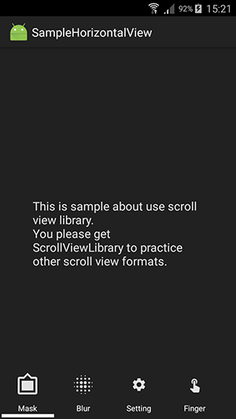

# ScrollViewLibrary

- A simple scroll view to allow add views to view group which can scroll horizontally or vertically.
- we designed the library with the best Design Pattern. It helps you easy to implement and custom if need.


## How to install

- we created a sample project to help you how to build your project with our own ScrollViewLib.
- First, you need to clone this project to local. Then, config your project as our Sample project to use.

Specifically,
1. Copy our own ScrollViewLib project to the same folder level with your project.
2. Add these lines in your `settings.gradle` file:
```
include ':ScrollViewLib'
project(':ScrollViewLib').projectDir = new File(settingsDir,'../ScrollViewLib/')
```
3. Add these lines to your `build.gradle` file (in your module).
```
implementation project(':ScrollViewLib')
```
4. Synchorize your project and use. (our ScrollViewLib will be synchronized with your project).

## How to use

we created a sample to use ScrollViewLib in our Sample project. So, please check it.

By the way, I note it again. 
1. Include the `CustomScrollView` into your layout `xml` file.
```xml
<com.reviewmobileapps.scrollviewlib.CustomScrollView
        android:id="@+id/horizontal_view"
        android:layout_width="match_parent"
        android:layout_height="wrap_content"
        android:gravity="left"
        android:layout_alignParentBottom="true"
        app:item_width="80dp"
        app:item_height="78dp"
        app:item_selectable="true"/>
```

2. Initialize CustomScrollView when your main Activity is created.
```java
CustomScrollView horizontalView = (CustomScrollView) findViewById(R.id.horizontal_view);
horizontalView.addItem(new ThumbnailWithTitleCardItem(R.drawable.ic_baseline_filter_frames, IScrollViewItem.Type.SHAPE_SETTING, R.string.title_mask));
horizontalView.addItem(new ThumbnailWithTitleCardItem(R.drawable.ic_baseline_blur_setting, IScrollViewItem.Type.GRAVITY_SETTING, R.string.title_blur_size));
horizontalView.addItem(new ThumbnailWithTitleCardItem(R.drawable.ic_baseline_settings, IScrollViewItem.Type.SETTING, R.string.title_border_setting));
horizontalView.addItem(new ThumbnailWithTitleCardItem(R.drawable.ic_baseline_touch_app, IScrollViewItem.Type.FINGER_SETTING, R.string.title_finger_settings));
horizontalView.addItem(new ThumbnailWithTitleCardItem(R.drawable.ic_baseline_rotation, IScrollViewItem.Type.ROTATION_SETTING, R.string.rotate_setting));
horizontalView.setHorizontalCallback(this);
horizontalView.select(0);
```

That's it !!!

## Customization

The following attributes can be set either xml to custom how child view display.
```xml
<declare-styleable name="CustomScrollView">
        <attr name="orientation" format="enum">
            <enum name="vertical" value="1"/>
            <enum name="horizontal" value="2"/>
        </attr>
        <attr name="item_width" format="dimension" />
        <attr name="item_height" format="dimension" />
        <attr name="item_textColor" format="color" />
        <attr name="item_backgroundColor" format="color" />
        <attr name="item_marginTop" format="dimension" />
        <attr name="item_marginBottom" format="dimension" />
        <attr name="item_marginLeft" format="dimension" />
        <attr name="item_marginRight" format="dimension" />
        <attr name="item_colorSelected" format="color" />
        <attr name="item_textSize" format="dimension" />
        <attr name="item_selectable" format="boolean" />
</declare-styleable>
```

Or you also can create new custom classes inherit from our base classes. Then, handle it as the way you want.

## Sample
Build our Sample project to know the interface.
we built it and the interface as below:



## Contributing

To contribute code you can do so through directly via GitHub by forking this repository and sending a pull request.
When submitting code, please make every effort to follow existing conventions and style in order to keep the code as readable as possible.

## License

Copyright 2018 by review mobile apps.

Permission is hereby granted, free of charge, to any person obtaining a copy of this software and associated documentation files (the "Software"), to deal in the Software without restriction, including without limitation the rights to use, copy, modify, merge, publish, distribute, sublicense, and/or sell copies of the Software, and to permit persons to whom the Software is furnished to do so, subject to the following conditions:

The above copyright notice and this permission notice shall be included in all copies or substantial portions of the Software.
